<!-- 
  Profile README for GitHub user: mohiuddin-khan-shiam
  This README showcases skills, projects, and GitHub activity
  Customize any section as needed!
-->

<!-- Header Section: Welcome banner with animated text -->

  

<!-- GitHub Header Metrics -->

  

<!-- Dynamic typing animation with key highlights -->

  

<!-- Social badges for quick access to profiles -->

  
  
  
  

<!-- Inspirational quote -->

  <em>"The best way to predict the future is to invent it."</em> 
  — Alan Kay

---

<!-- About Me Section: Personal introduction and background -->

  
  <strong style="font-size:2em;">👋 About Me</strong>

Hi! I'm S. M. Mohiuddin Khan Shiam. I love using technology to help people and make the world a better place. I'm interested in research, learning new things, and helping my community.

Since I was a child, I've been curious about technology and space. I want to use my skills to support important causes like education, health, human rights, protecting the environment, and caring for animals. I believe that by learning about different subjects and thinking carefully, I can help solve real problems.

I've learned a lot about leadership, teamwork, and planning by working on different projects and activities. These experiences taught me to work well with others, adapt to new situations, and keep learning. I think challenges help us grow, and real education shows in how we treat people.

My family and teachers have always supported me, and their advice has helped me become a kind and determined person. In my free time, I enjoy traveling, playing football, and reading Harry Potter books. These hobbies make me happy and help me learn from my experiences.

I believe that kindness and new ideas can change the world. I'm excited to meet others who also want to make the world a better place.

---

<!-- Open Source Contributions Section -->

  
  <strong style="font-size:2em;">🌟 Open Source Contributions</strong>

  <em>Contributing to the global developer community through meaningful code contributions</em> 
  
  

### 🏢 **Microsoft Ecosystem**

  
  
  
  

  
  
  

### 🤖 **Machine Learning & AI**

  
  
  
  

### ☁️ **Cloud & DevOps**

  
  
  
  

### 🧬 **Computational Biology & Research**

  
  

### 📚 **Education & Algorithms**

  

  <table>
    <thead>
      <tr>
        <th>🏆 Category</th>
        <th>📊 Projects</th>
        <th>🌐 Impact</th>
      </tr>
    </thead>
    <tbody>
      <tr>
        <td><strong>Microsoft Tools</strong></td>
        <td>7 Major Projects</td>
        <td>Developer Productivity & Windows Ecosystem</td>
      </tr>
      <tr>
        <td><strong>AI/ML Frameworks</strong></td>
        <td>4 Core Libraries</td>
        <td>Machine Learning & Computer Vision</td>
      </tr>
      <tr>
        <td><strong>Cloud Infrastructure</strong></td>
        <td>4 DevOps Tools</td>
        <td>Container Orchestration & Workflows</td>
      </tr>
      <tr>
        <td><strong>Research & Education</strong></td>
        <td>3 Specialized Tools</td>
        <td>Scientific Computing & Learning</td>
      </tr>
    </tbody>
  </table>

  
  

<b>🔍 View Detailed Contribution Areas</b>

**Developer Tools & Productivity:**
- **VS Code**: Enhanced editor functionality and extensions
- **Terminal**: Improved Windows terminal experience  
- **WSL**: Better Linux subsystem integration
- **PowerToys**: Windows productivity utilities

**AI & Machine Learning:**
- **scikit-learn**: Core ML algorithm implementations
- **Keras**: Deep learning model architectures
- **Ultralytics**: Computer vision and YOLO improvements
- **OpenVINO**: AI inference optimization

**Infrastructure & DevOps:**
- **Kubernetes**: Container orchestration enhancements
- **Apache Airflow**: Workflow management improvements
- **Flux**: GitOps and continuous deployment

**Research & Education:**
- **The Algorithms**: Educational algorithm implementations
- **Manim**: Mathematical animation library
- **Boltz**: Biomolecular interaction modeling

---

<!-- GitHub Activity -->

  <strong style="font-size:1.5em;">📈 GitHub Activity</strong>

  

---

<!-- Featured Project Section: Highlighting main project -->

  
  <strong style="font-size:2em;">🚀 Featured Project</strong>

  <a href="https://github.com/mohiuddin-khan-shiam/SkillShikhi"><strong>SkillShikhi</strong></a> 
  A platform for skill sharing and learning built with Next.js and MongoDB, following MVC architecture.

---

<!-- Repository Statistics -->

  <strong style="font-size:1.5em;">📊 Repository Statistics</strong>

  

---

<!-- Skills Section: Organized by categories for better readability -->

  
  <strong style="font-size:2em;">🛠️ My Skill Set</strong>

<!-- Programming Languages -->

  <strong>💻 Programming Languages</strong>

  
  
  
  

  
  
  
  

<!-- Web Technologies & Databases -->

  <strong>🌐 Web Technologies & Databases</strong>

  
  
  
  
  

<!-- Data Science & AI Libraries -->

  <strong>🤖 Data Science & AI Libraries</strong>

  
  
  
  
  

<!-- Research & Technology Domains -->

  <strong>🔬 Research & Technology Domains</strong>

<!-- AI & Machine Learning Row -->

  
  
  

<!-- Computational Sciences Row -->

  
  
  

<!-- Technology & Security Row -->

  
  
  

<!-- Software Engineering Row -->

  

---

<!-- GitHub Statistics Section: Comprehensive activity overview -->

  
  <strong style="font-size:2em;">📊 GitHub Stats & Activity</strong>

<!-- Contribution Streak Statistics -->

  <strong>🔥 Contribution Streak</strong>

  

<!-- General Stats and Language Usage -->

  <strong>📈 Overall Statistics & Top Languages</strong>

  
  

<!-- Detailed Activity Summary -->

  <strong>📊 Detailed Activity Summary</strong>

  

<!-- Achievement Trophies -->

  <strong>🏆 GitHub Achievements</strong>

  

---

<!-- Connect Section: Beautiful and interactive social links -->

  
  <strong style="font-size:2em;">🤝 Connect with Me</strong>

  <em>Let's collaborate and create something amazing together! 🚀</em>

  <table>
    <tr>
      <td align="center">
        <a href="https://www.linkedin.com/in/s-m-mohiuddin-khan-shiam/" target="_blank">
           
          <b>LinkedIn</b>
        </a>
      </td>
      <td align="center">
        <a href="https://github.com/mohiuddin-khan-shiam" target="_blank">
           
          <b>GitHub</b>
        </a>
      </td>
      <td align="center">
        <a href="mailto:contact.shiam@gmail.com" target="_blank">
           
          <b>Email</b>
        </a>
      </td>
      <td align="center">
        <a href="https://mohiuddin-khan-shiam.github.io" target="_blank">
           
          <b>Portfolio</b>
        </a>
      </td>
    </tr>
  </table>

  
  

---

<!-- Contribution Calendar -->

  <strong style="font-size:1.5em;">📅 Contribution Calendar</strong>

  

---

<!-- Snake Animation Section -->

  
  <strong style="font-size:1.5em;">🐍 Watch My Contribution Graph Get Eaten By The Snake</strong>

  <picture>
    <source media="(prefers-color-scheme: dark)" srcset="https://raw.githubusercontent.com/mohiuddin-khan-shiam/mohiuddin-khan-shiam/output/github-contribution-grid-snake-dark.svg" />
    <source media="(prefers-color-scheme: light)" srcset="https://raw.githubusercontent.com/mohiuddin-khan-shiam/mohiuddin-khan-shiam/output/github-contribution-grid-snake.svg" />
    
  </picture>

---

<!-- Profile visitor counter -->

  

---

<!-- 
  Thank you for visiting my profile README!
  This README includes organized sections for skills, detailed GitHub statistics,
  and enhanced connectivity options for collaboration.
  Feel free to customize any part of this markdown file.
-->
